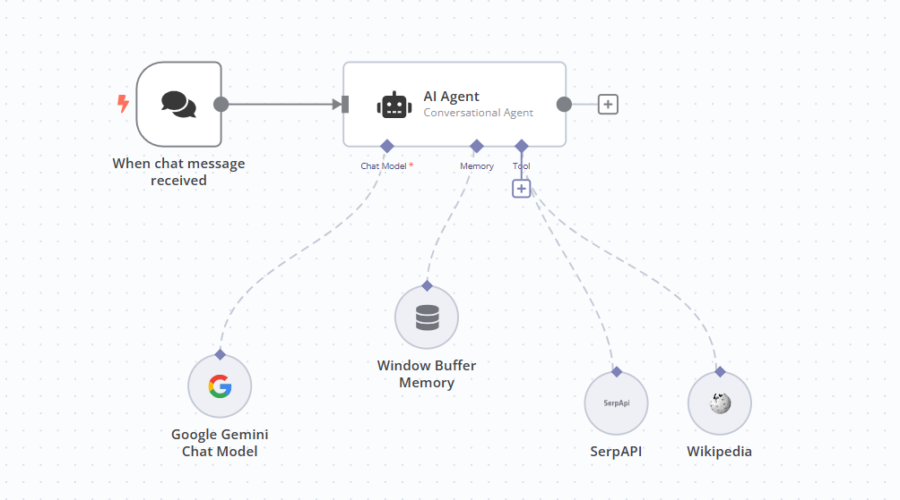
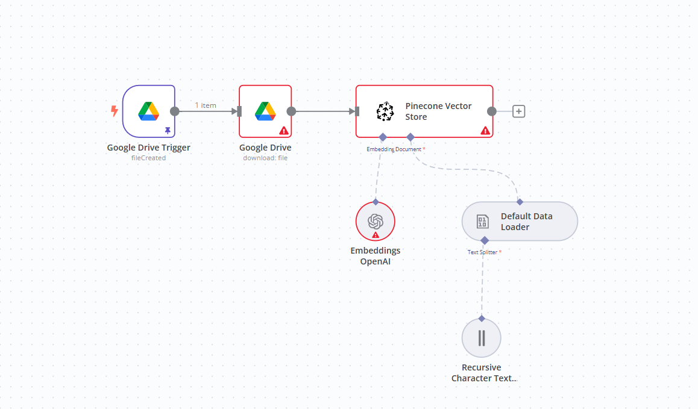
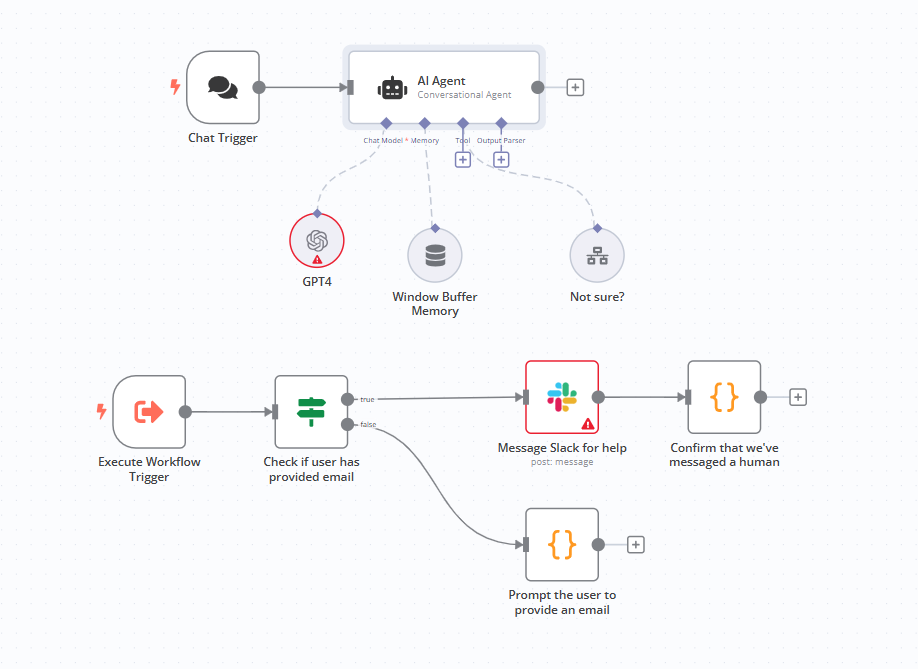

# n8n Workflow Assignment

## Assignment Description

In this assignment, we leverage the **n8n platform** to create three unique apps using various workflows and integrations. The apps cover a diverse set of use cases:
1. **A Chat Application** for customer support.
2. **A Backend-Triggered Application** (e.g., email automation or Kafka-based backend trigger).
3. **A Human-in-the-Loop Workflow**, where AI invokes a human agent for assistance when necessary.

These workflows utilize agents, memory buffers, integrations like Slack, Pinecone, OpenAI, and tools like GPT-4 and Google Gemini.

---
# [Demo Video](https://drive.google.com/file/d/1NltsjwpyQs5gbr9LWv0MBLks3iuo-2ji/view?usp=sharing)

## Part A: Chat Application (ChatApp)

### Description:
This app provides a **chat frontend** for customer support. It integrates AI models like **Google Gemini** for conversation handling, along with Wikipedia and SerpAPI for external information retrieval. It also uses a **Window Buffer Memory** for maintaining chat history.

### Key Components:
- **Trigger**: When a chat message is received.
- **AI Agent**: Handles conversations using a chat model (Google Gemini).
- **Tools**: Wikipedia, SerpAPI for external search.
- **Memory**: Window Buffer Memory to retain chat context.

### Workflow:

---

## Part B: Backend Trigger (BackendTrigger)

### Description:
This app operates in a **backend-triggered fashion**, such as processing an event from Kafka, triggering on email creation, or backend file uploads. It downloads files from Google Drive, processes them using **OpenAI Embeddings** and **Pinecone Vector Store** for vector storage, and splits text when needed.

### Key Components:
- **Google Drive Trigger**: Monitors file creation.
- **Google Drive**: Downloads the uploaded file.
- **Pinecone Vector Store**: Processes and stores embeddings.
- **Embeddings**: OpenAI-based document embedding.
- **Text Splitter**: Recursive character splitter for large documents.

### Workflow:

---

## Part C: Human Agent Workflow (HumanAgent)

### Description:
This app ensures a **human-in-the-loop** approach when the AI cannot provide an appropriate response. It uses Slack to alert a human agent for assistance and confirms a response back to the user.

### Key Components:
- **Trigger**: Chat initiation or workflow execution.
- **AI Agent**: GPT-4 model handles the conversation.
- **Slack Integration**: Sends a message to a human agent when AI is unsure.
- **Condition Check**: Verifies user-provided email.
- **Human Loop**: Prompts for email or confirms a human intervention.

### Workflow:

---

## References
- n8n Workflow Templates: [n8n.io/workflows](https://n8n.io/workflows/)
- Human-in-the-Loop Workflow: [Ask a Human for Help](https://n8n.io/workflows/2095-ask-a-human-for-help-when-the-ai-doesnt-know-the-answer)

---
